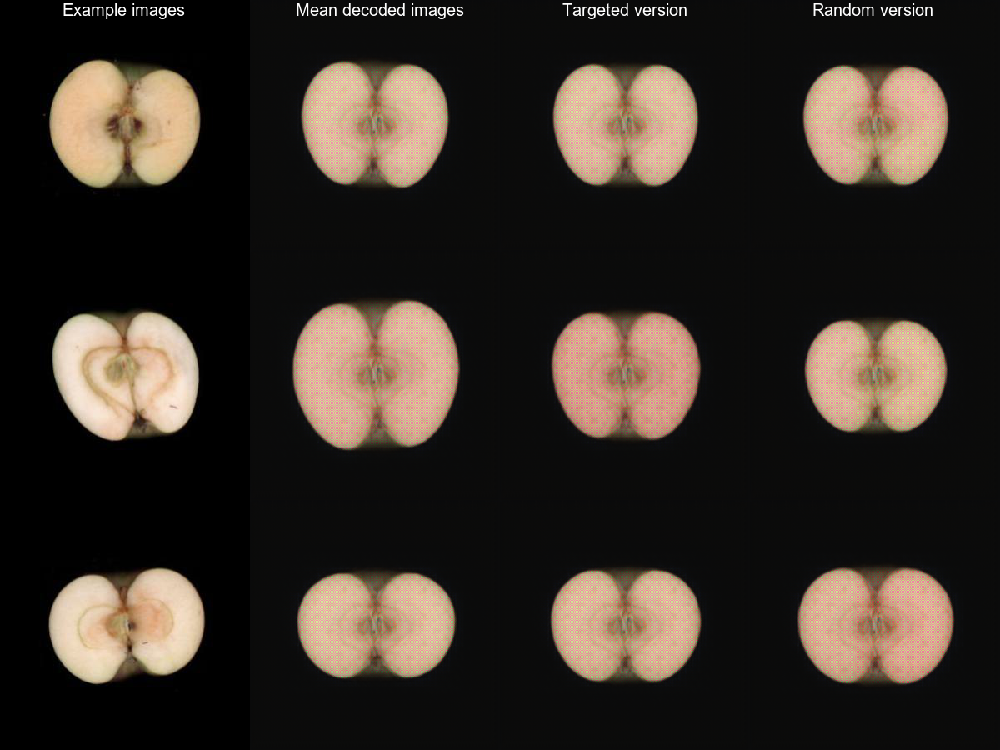

#GenoDrawing

This repository is intended to replicate and show the results of the paper:
https://spj.science.org/doi/10.34133/plantphenomics.0113

### Usage
Clone the repository with:
```powershell
git clone https://github.com/Fedjurrui/GenoDrawing.git
```
Move inside the folder:
```powershell
cd GenoDrawing
```
Then install the requirements:
```powershell
pip install -r requirements.txt
```
Get the weights for the autoencoder from:
- Decoder: https://huggingface.co/aranzana-lab/genodrawing/resolve/main/decoder_7_2_2023_15h.h5?download=true
- Encoder: https://huggingface.co/aranzana-lab/genodrawing/resolve/main/encoder_7_2_2023_15h.h5?download=true

Place the both files at: `GenoDrawing/AE_model/64_encoders_35_epochs/model_data_7_2_2023_15h/`

Open using [Visual Studio Code](https://code.visualstudio.com/) the folder and open the autoencoder notebook file. Be mindful that it is a jupyter notebook, so if you have not worked with notebooks you might find the [documentation on jupyter notebook in VSCode](https://code.visualstudio.com/docs/datascience/jupyter-notebooks) usefull. From there you can open the GenoDrawing file and last the GenoDrawing_stats.

### Recomendations
It is highly encouraged to use a GPU. Inference times are greatly improved doing so eventhough it is not strictly required and the code has been prepared to run on CPU.

##Abstract

### GenoDrawing: An autoencoder framework for image prediction from SNP markers

Advancements in genome sequencing have facilitated whole genome characterization of numerous
plant species, providing an abundance of genotypic data for genomic analysis. Genomic selection
and neural networks, particularly deep learning, have been developed to predict complex traits from
dense genotypic data. Autoencoders, a neural network model to extract features from images in
an unsupervised manner, has proven to be useful for plant phenotyping. This study introduces an
autoencoder framework, GenoDrawing, for predicting and retrieving apple images from a low-depth
single nucleotide polymorphism (SNP) array, potentially useful in predicting traits that are difficult
to define. GenoDrawing demonstrated proficiency in its task while using a small dataset of
shape-related SNPs, and multiple experiments were conducted to evaluate the impact of SNP selection
and shape relation. Results indicated that the correct relationship of SNPs with visual traits
had a significant impact on the generated images, consistent with biological interpretation. While
using significant SNPs is crucial, incorporating additional, unrelated SNPs results in performance
degradation for simple NN architectures that cannot easily identify the most important inputs. The
proposed GenoDrawing method is a practical framework for exploring genomic prediction in fruit
tree phenotyping, particularly beneficial for small to medium breeding companies to predict economically
significant heritable traits. Although GenoDrawing has limitations, it sets the groundwork
for future research in image prediction from genomic markers. 





